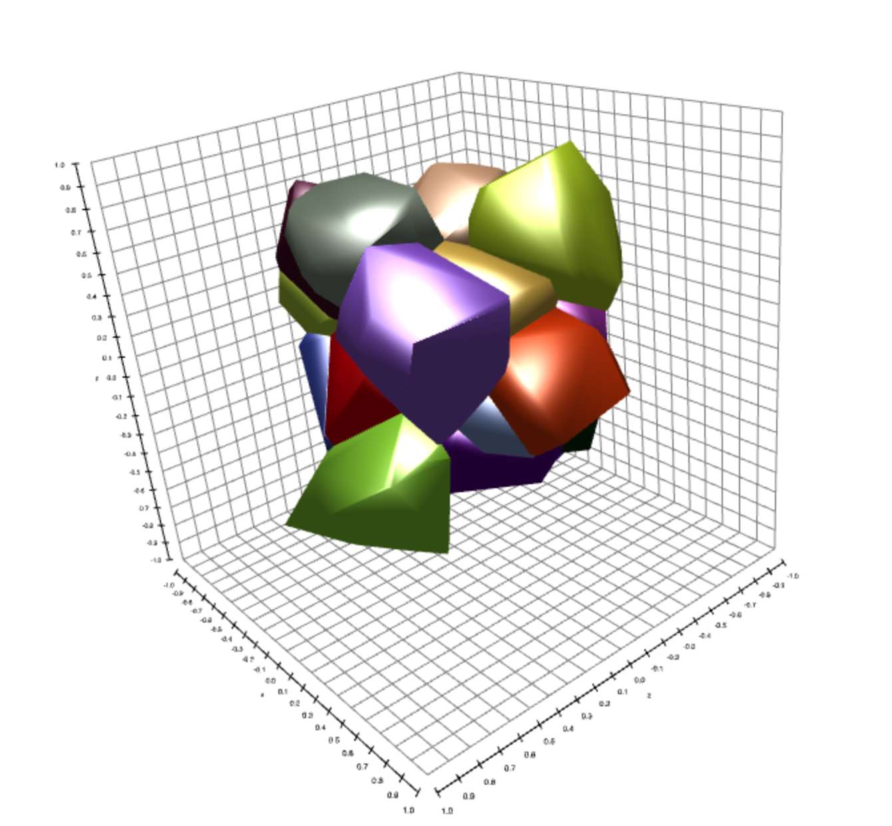

voronoi-diagram
===============
Construct a voronoi diagram for a collection of points.  Works in any dimension in both node.js and in a web browser



* [2D Voronoi diagram demo](http://mikolalysenko.github.io/voronoi-diagram/2d.html)
* [3D Voronoi diagram demo](http://mikolalysenko.github.io/voronoi-diagram/3d.html)

[](https://ci.testling.com/mikolalysenko/voronoi-diagram)

[](http://travis-ci.org/mikolalysenko/voronoi-diagram)

# Example

```javascript
var voronoi = require("voronoi-diagram")

var points = [
  [1, 0],
  [0, 1],
  [0, 0]
]

console.log(voronoi(points))
```

# Install

```
npm install voronoi-diagram
```

# API

#### `require("voronoi-diagram")(points)`
Constructs a voronoi diagram for a collection of points.

* `points` is an array of points in `n`-dimensional space

**Returns** An object with two properties

* `positions` an array of points representing the location of the voronoi sites
* `cells` an array of indices with the same length as `points` representing the voronoi sites.  `-1` indicates a point at infinity.  In 2D the cells are oriented clockwise, while in 3D they are sorted lexicographically.

## Credits
(c) 2013 Mikola Lysenko. MIT License